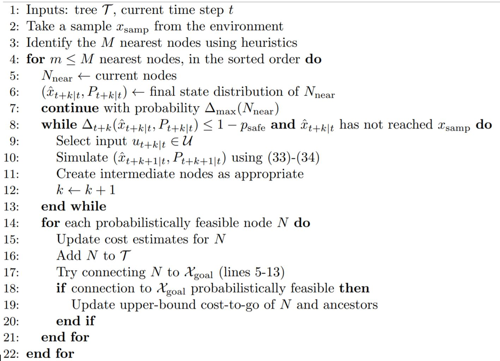

# Chance Constrained RRT for Self-Driving Cars

Reference Paper: Chance Constrained RRT for Probabilistic Robustness to Environmental Uncertainty by Brandon Luders, Mangal Kothari and Jonathan P. How.

## Problem Statement

a.Rapidly Exploring Random Tree (RRT) – efficient method for searching in high dimensional spaces.

b.RRT missing safety constraints in case of uncertainty.

## Goal
The goal for this project is to search safe paths in a given map by checking for the probabilistic feasibility for each path and discard the path with high probability of collision.

## Pseudocode: CC-RRT

## Assumptions

a.Static environment (Obstacles do not move)

b.Model for determining uncertainty
